# Docker Lab Tasks and Solutions

---

## Problem 1: Basic Container Operations (hello-world)

### Task
Work with the `hello-world` container to practice basic Docker operations.

### Steps

#### 1. Run the hello-world container
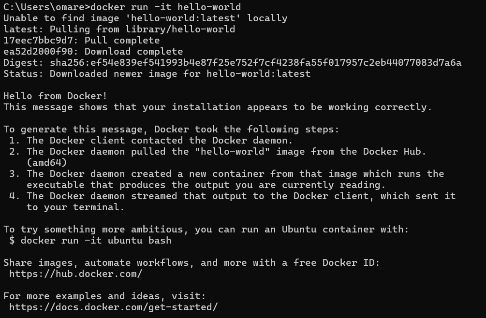

#### 2. Check the container status
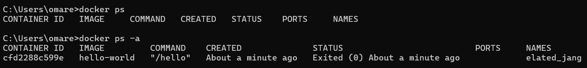

#### 3. Start the stopped container
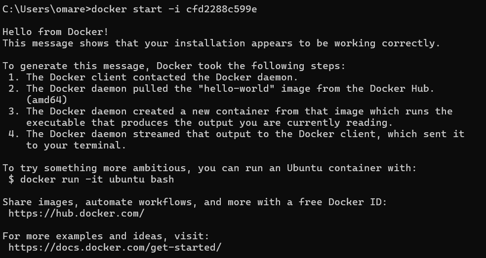

#### 4. Remove the container
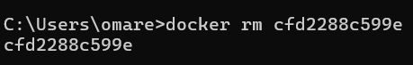

#### 5. Remove the image
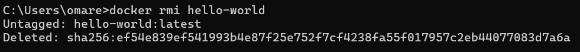
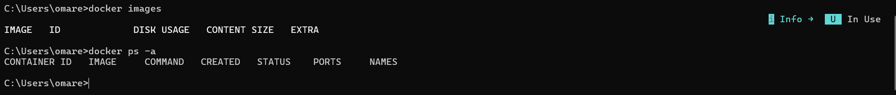

---

## Problem 2: Interactive Container with CentOS/Ubuntu

### Task
- Run container CentOS or Ubuntu in an interactive mode
- Run the following command in the container: `echo docker`
- Open a bash shell in the container and touch a file named `hello-docker`
- Stop the container and remove it. Write your comment about the file `hello-docker`
- Remove all stopped containers

### Solution
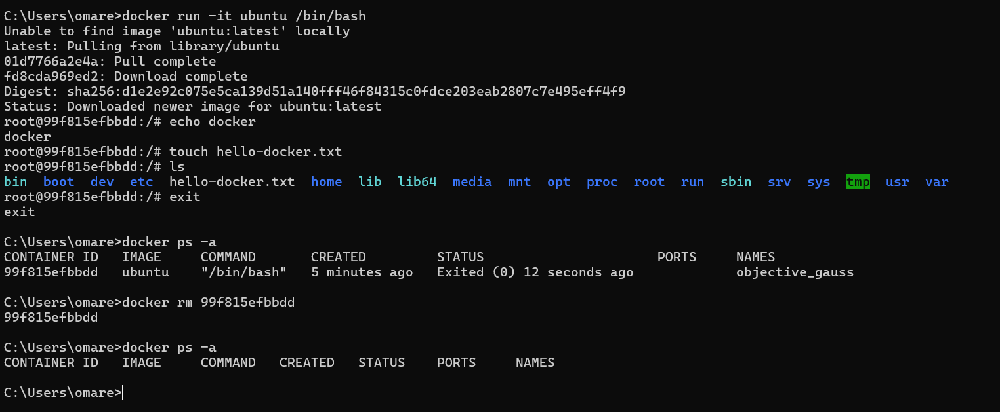

### Comment
> **Note:** The hello-docker file is deleted with the container. Container filesystems are ephemeral by default.

---

## Problem 3: MySQL Database Deployment

### Task
Deploy a MySQL database called `app-database` with the following requirements:
- Use the `mysql` latest image
- Use the `-e` flag to set `MYSQL_ROOT_PASSWORD` to `P4sSw0rd0!`
- The container should run in the background

### Solution
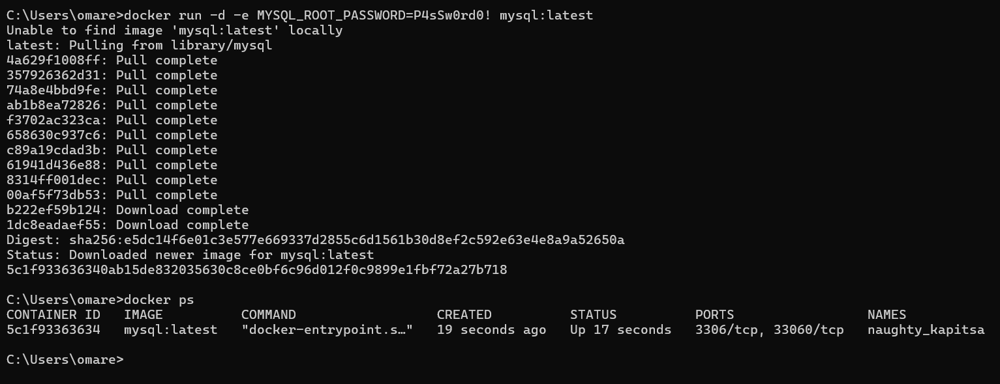

---

## Problem 4: Nginx Container with Static Files

### Task
- Run the Nginx image
- Add HTML static files to the container and make sure they are accessible
- Commit the container with image name `IMAGE_NAME`

### Solution

#### Running and configuring Nginx container
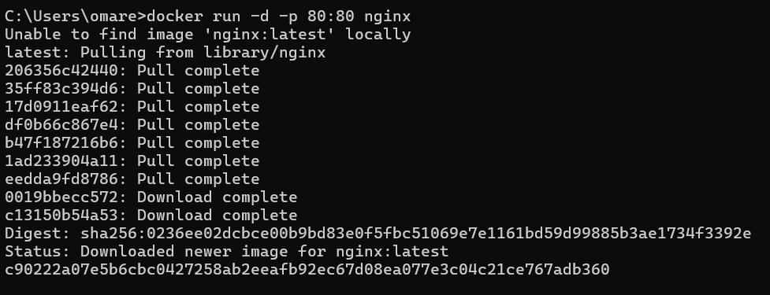
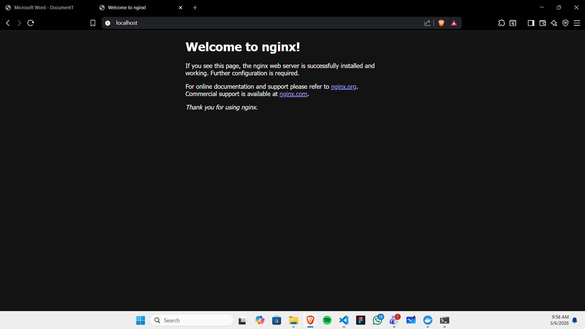
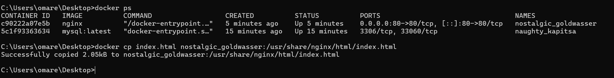
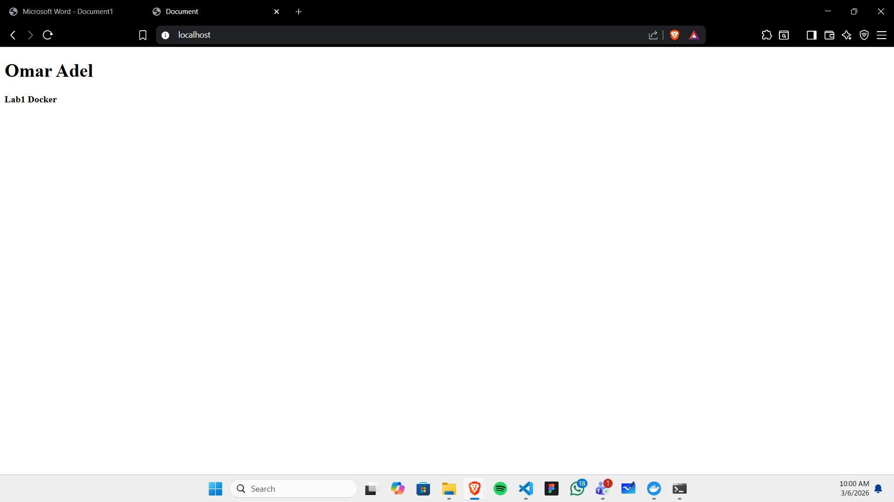
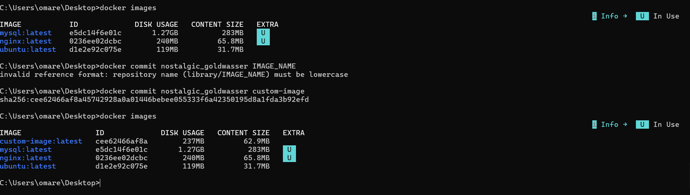

---

## Problem 5: Python Application Containerization

### Task
- Create a Python simple app
- Create a Dockerfile to containerize the Python app
- Build the image and test it

### Solution

#### Python application and Dockerfile
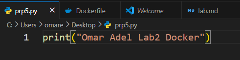

#### Building and testing the image
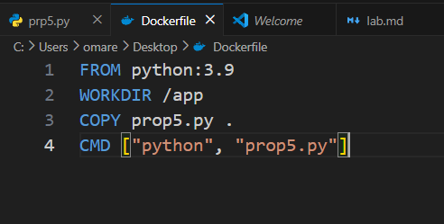
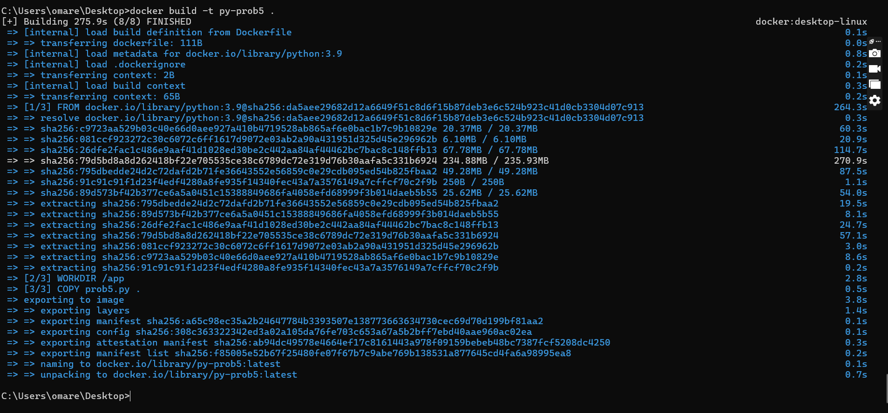
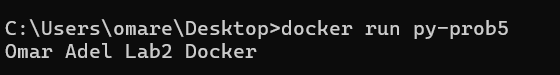

---
# lab2
## Problem 1: Docker Named Volumes

### Volumes Configuration
- **Volume1**: for containing static html file
- **Volume2**: for containing nginx configuration

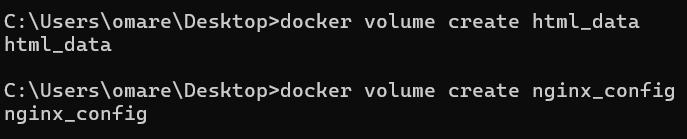

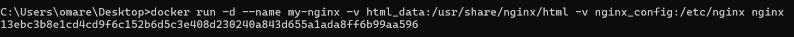

## Steps

### 1. Edit the html content

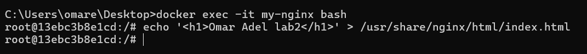

### 2. Remove the container

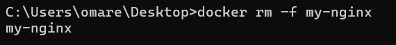

### 3. Run a new 2 containers with the following:

- Attach the two volumes that were attached to the previous container using volume mount
- Map port 80 to port 8080 on your host machine

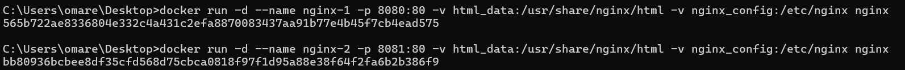

### 4. Access the html files from your browser

**Port 8080:**

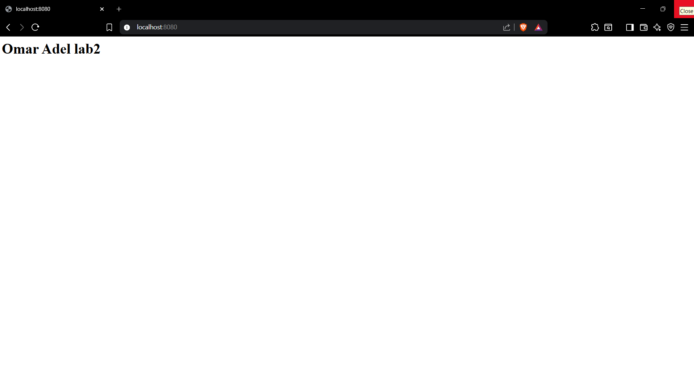

**Port 8081:**

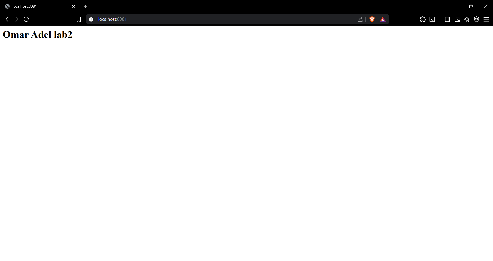

---

# Problem 2: Docker Bind Mounts

## Objective
Run a container Nginx with name nginx-bind-mount and attach 2 volumes using bind mount under any paths

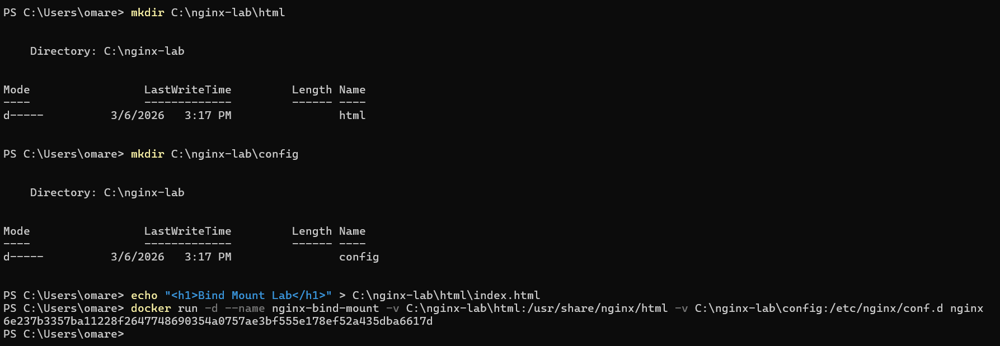

## Steps

### 1. Remove the container

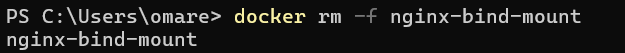

### 2. Run a new container with the following:

- Attach the two volumes that were attached to the previous container

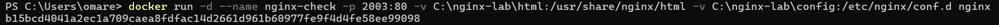

- Check the old data in the new containers

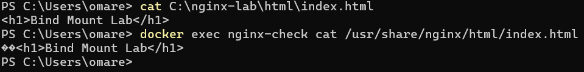

## Task

### 1. Create the Networks

### 2. Create the Nginx Container

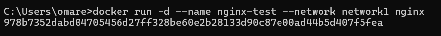

### 3. Create the Flask App Container (The Bridge)

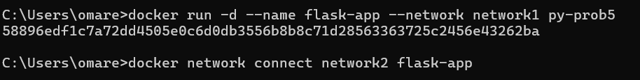

### 4. Create the MariaDB Container

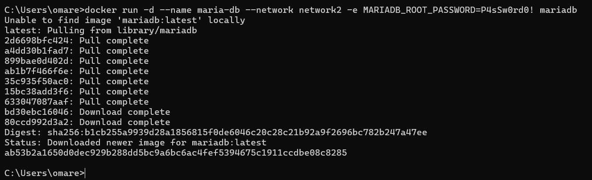

### 5. Verification (The Curl Test)

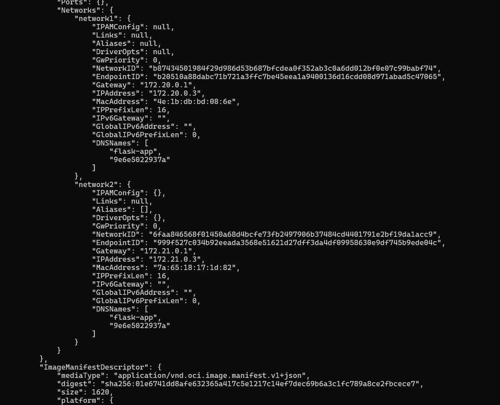

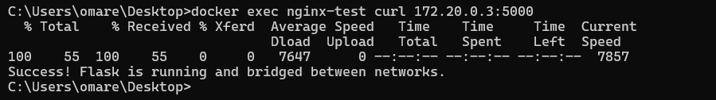